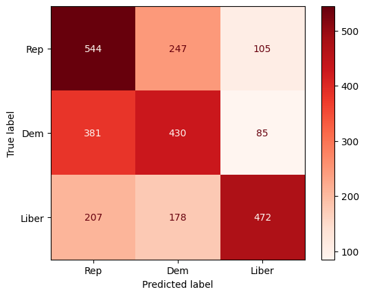

# Project 3: Reddit, White, and Blue
## Can Natural Language Processing Identify Political Affinity?

---
### Problem Statement
A research firm with a political polling division needs to identify candidates for an online tracking study it's launching in six months. The study will require a steady stream of respondents with certain political affinities (Democrat, Republican, and Libertarian) to meet the sample requirements of the study.

* **Goal #1:** Find a way to identify potential candidates with specific political affinities via several online resources (social media, survey responses, etc.).
* **Goal #2:** Reveal the key words or phrases that aid in identifying people's political affinity. 

With so much text-based data, can machine learning utilizing natural language processing help us achieve these goals?

---

### Executive Summary

#### Reddit to the rescue
Reddit1 filled our need for an accessible, free data source where we could find written content from users who self-identified into one of the three political affinity groups we want to predict. The following subreddits were selected for their member size and submission frequency:  
* r/democrats: 158k Members
* r/Republican: 163k Members
* r/Libertarian: 442k Members
Utilizing the [Pushshift API](https://github.com/pushshift/api), 3,000 posts from each of the three subreddits were pulled for the 4-5 week time period immediately preceding 11/28/2020.2

#### Getting ready...
In order to prepare our data for modeling, data cleaning and some preliminary data analysis was performed on the 9,000 submissions in our dataset. This part of the process included: checking for duplicates, cleaning out web links, combining title body text of submission into a unified text feature, creating features for text length and word count, and finally previewing unigram, bigram, and trigrams to get us ready for the modeling process.3 At the end of this stage, the cleaned and prepared data was exported for use in building our models.

#### Many models entered, one model emerged...
The transformers CountVectorizer and TFIDF (Term Frequency Inverse Document Frequency) Vectorizer were paired with four different classification models and run several times each utilizing a wide variety of hyperparameters to try to identify the model with best accuracy scores over. The scores for the top models that emerged from each set of tests were:4

|Model|Model Accuracy Score|Training Data Accuracy Score|Test Data Accuracy Score|
|---|---|---|---|
Logistic Regression|54.0%|65.7%|54.6%|
Support Vector Machines|53.6%|81.7%|54.6%|
Random Forest|49.3%|51.9%|46.9%|
Gaussian Naive Bayes|48.0%|56.6%|49.9%|

After reviewing the performance of the various models, the Logistic Regression model was selected.

While still overfit, it had...
* The best crossval accuracy score of the model "winners"
* The best testing data accuracy score of the model "winners'
* An improvement over our baseline score by 20.8% (33.8% baseline vs 54.6% test data)

Additionally, logistic regression gave us...
* Easy interpretability -- especially if we use one-versus-the-rest for multinomial classification
    * Coefficients will be interpretable as the log-odds compared to all other classes, holding all else constant.

#### Rebuilding our logistic regression model and analyzing the results
After selecting the model, we rebuilt it using the parameters we had saved during our multiple runs. We built a confusion matrix to visualize the predictive results. For the 2,649 predictions made on our test data, we had a strong positive predictive rate for Libertarians (71%) and best true positive rate for Republicans (61%).

What's most interesting is where we missed. Most notably the Democrats we predicted to be Republicans. If we dug a little deeper into understanding why we missed here, the corrections would likely have a ripple effect on the entire matrix. In our next iteration, perhaps the creation of unique set of stop words would be the next step.

Finally, we examined the features with the highest and lowest coefficients and provided a sample interpretation of the exponentialized log-odds to demonstrate to the client how they could be used.
Due to the size of the charts, they are not provided here. Please see the presentation located in this repository or the notebook for more details.

1 [109 Ridiculous Reddit Statistics & Facts to Know in 2020](https://websitebuilder.org/blog/reddit-statistics/)  

2 For detailed information, see notebook [01_Web_Scraping_Reddit_Data_Collection](01_Web_Scraping_Reddit_Data_Collection.ipynb)  

3 For detailed information, see notebook [02_Data_Cleaning_EDA](02_Data_Cleaning_EDA.ipynb)  

4 For detailed information, see notebook [03_Models_Analysis](03_Models_Analysis.ipynb)

---

### Data Dictionary
|Feature|Feature Name|Data Type|Description|
|---|---|---|---|
|Score|score|int|The number of upvotes minus the number of downvotes|
|Number of comments|num_comments|int|Number of comments on the submission|
|Text length|text_length|int|Total length of `all_text` text string including spaces|
|Rough word count|rough_word_count|int|The count of all 'words' created when the `all_text` text string is split on spaces|
|All text|all_text|str|The combined title and selftext strings from the submission|
|Subreddit|subreddit|int|The subreddit of the submission mapped as 0 for Republican, 1 for Democrat, and 2 for Libertarian|

---

### Conclusion, Recommendations, and Next Steps
In conclusion, we were able to demonstrate that machine learning utilizing NLP can provide the predictive power to categorize written content trained on similar data as our model outperformed the baseline score by 20.8% (33.8% baseline vs 54.6% test data). We also demonstrated that resulting coefficients were interpretable and could provide real guidance as to the how individual word features influence the likelihood of a post being categorized to particular class.

However, the models and analysis provided here is only the first step in fulfilling the needs of the problem statement in any long-term, real way. After more data collection and further analysis using this logistic regression, the predictive power would likely be increased by going to a less-interpretable black-box model like a neural network. If the interpretability also remains a priority, perhaps two models should be built and maintained -- one for each purpose.

#### Next Steps
* Additional preprocessing work
    * Additional lemmatizing and stemming of text elements
    * Build and test custom stop words dictionaries

* Additional model tuning
    * Improving bias/variance trade off
    * Deeper analysis of missed predictions

* Assess model effectiveness over time
    * Too general: perhaps lower predictive power
    * Too specific: would need to be updated with every news cycle
    * Custom stop words could help

* Utilizing numeric data with the vectorized word data by implementing a feature union as part of the pipeline
    * Word counts
    * Text length
    * Scores (from Reddit)
    * Sentiment analysis

